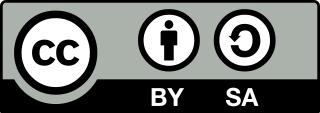

# You Want Open Source?（你想開源嗎？）

#### 作者：HiCat

#### 本文章由 HiCat 編寫，是為了提供大家一個了解開源軟體的管道。採用 CC-協議 的 BY-SA （使用者需標明出處、可商業化，但請跟我講一聲），想了解更多協議資訊[請按此](https://creativecommons.org/licenses/by-sa/4.0/legalcode)。

## 前言：

### 我個人非常喜歡開源軟體及其理念，我覺得資訊和技術的共享及透明非常重要，堅持開源能使人類技術發展更加快速。但我發現在台灣，只有程序員及相關產業的人員才會接觸開源軟體，就算是知道開源軟體的一般人，也會以為開源軟體晦澀難懂而近而遠之，導致台灣的使用者非常少，竟而使開源項目不會對台灣使用者進行適配（翻譯或修補字體漏洞等）。所以我才希望透過此文章，不只讓台灣的開發者了解到開源的重要性及優勢，也讓一般人了解到開源軟體以不像以前一樣難以駕馭，相反地現今已有不少可以媲美甚至勝過市面上專有軟體的開源項目，藉此讓開源理念在台灣能夠蓬勃發展，也讓開源軟體看見台灣的使用者。

## 目錄：

### [第一章：我所了解的開源軟體與理念](MarkDown/One.md)

### 第二章：開源的歷史

### 第三章：開源社區的分工與維持

### 第四章：各開源協議介紹

### 第五章：開源商業化

### 第六章：從現今知名的開源項目來了解開源的優勢與雷區

### 第七章：結語